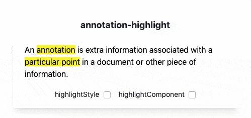

## vue-annotation-highlight
A Vue.js library to highlight annotations.

<p align="center">
  
</p>

## Install
In your project folder: 
```
npm install vue-annotation-highlight --save
```
or 
```
yarn add vue-annotation-highlight
```

## Usage 
In your component: 
```javascript
import { AnnotationHighlight } from 'vue-annotation-highlight'
```
Add the component to your template
```html
<annotation-highlight 
  :text="textToRender" 
  :annotations="annotationsToHighlight"
/>
```
Specify required properties
```javascript
data() {
  return {
    textToRender: 'An annotation is extra information associated with a particular point in a document or other piece of information.',
    annotationsToHighlight: [
      { begin: 3, length: 10, source:'PRED', confidence:'0.9' },
      { begin: 53, length: 16, source:'PRED', confidence:'0.7' }
    ]
  }
}
```

⚡️ Each annotation must have at least `begin` and `length` properties.

## Properties 

| Prop  | Expected type | Required | 
| ------------- | ------------- | ------------- |
| `text`  | String  | ☑️ |
| `annotations` | [Object, Array] |  
| `highlightStyle`  | [String, Object]  | 
| `highlightComponent`  | Object  | 

⚡ AnnotationHighlight passes the rendered annotation as `annotation prop` to your `highlightComponent` where you can extract the specific object. Find an example here:  [/components/MyHighlightComponent.vue](https://github.com/wkrl/vue-annotation-highlight/blob/master/src/components/MyHighlightComponent.vue)

